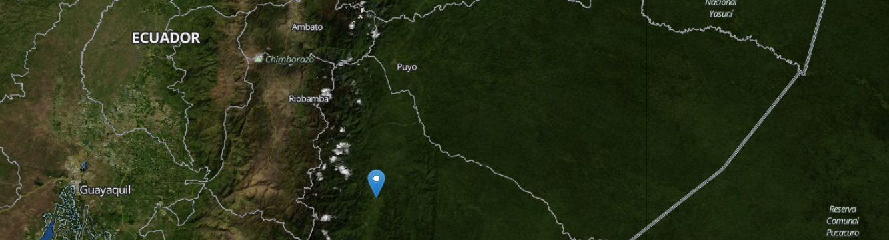
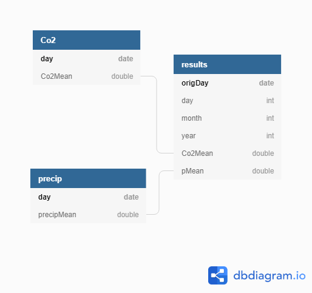
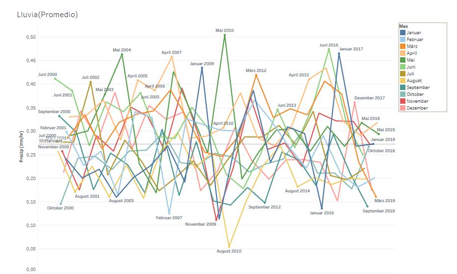
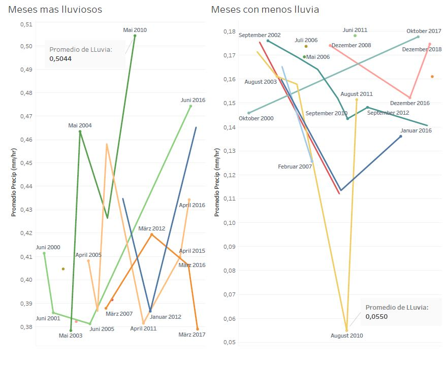
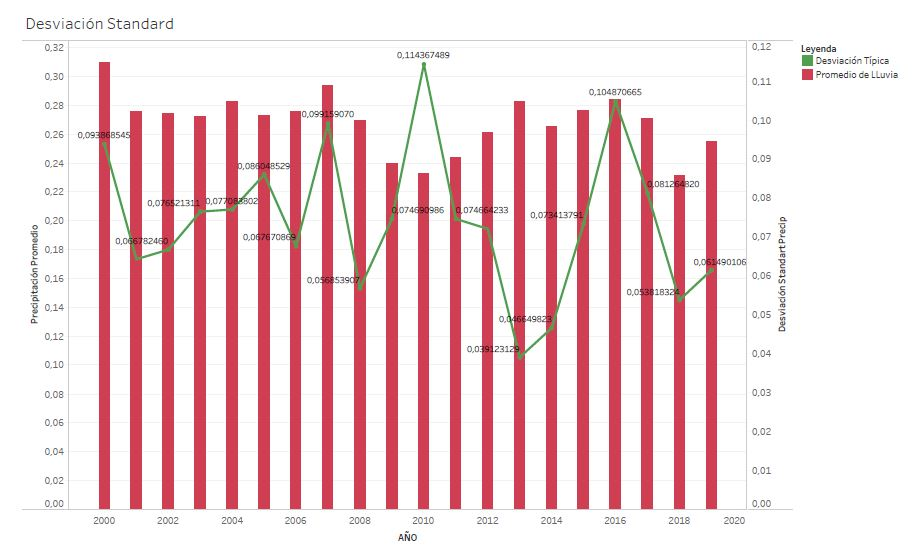
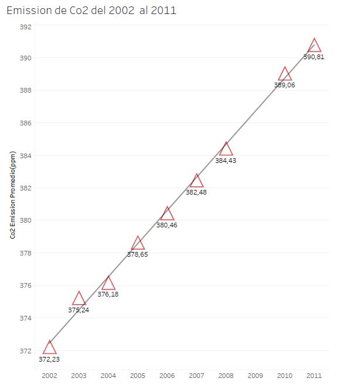

# Precipitation Vs CO2 Emissions for my Hometown


### INTRODUCTION

The purpose of this project is to find out if the amount of CO2 Emissions has affected the average of precipitations in the city where I come from. The Idea came into my mind after several visits  to my hometown during the last 20 years. I can remenber that during my childhood we used to have longer periods of sunny days during the school summer holidays and now after almost 30 years, there are no  days without precipitations at all, it rains almost every day and after observing the vegetation, it is also known that some plants are not growing any longer.  Because the weather has indeed changed. In order to answer to those questions I decided to gather some scientific trustfull information for further analysis. After searching several data providers on the internet, I found usefull datasets at earthdata.org, where all the needed information is available, with different sources and facilities to download the satellites collected data.

#### First Data Set

DATA SET:AIRS

AQUA Satellite

LAUNCHED:May 2002

ABOUT AIRS
The Atmospheric Infrared Sounder, AIRS, was launched aboard the Aqua space-craft in 2002 as part of NASA's Earth Observing System Afternoon Constellation of satellites in a sun-synchronous polar orbit known as the A-Train. AIRS thermal infrared hyperspectral observa- tions are used to retrieve temperature and water vapor profiles, and numerous trace gases including carbon dioxide, ozone, carbon monox- ide, and methane. AIRS data improve weather prediction, validate climate models, and improve our understanding of the processes affect- ing weather and climate and the global transport of greenhouse gases worldwide.

This dataset comes from: https://airs.jpl.nasa.gov. This satellite collects data for CO2 emissions during a period  of time from  2002 up to 2011. The data corresponds to LEVEL 2, then the data are at the original footprint level. That is, the Level 2 datasets include longitude and latitude information along with the corresponding CO2 values (and other auxiliary and geophysical variables of interest) at the footprints over which the instruments collected data.


#### Second Data Set

From the Website (https://pmm.nasa.gov/GPM ) which corresponds to an international satellite mission called NASA's Global Precipitation Measurement (GPM)  that uses multiple satellites orbiting Earth to collect rain, snow and other precipitation data worldwide every thirty minutes. Providing a detailed dataset of global precipitation observations that span almost two decades. These observations are available for most of the world. 
The dataset for the precipitation information has a time rage from 2000 till 2018 and the provided latitude and longituted are for the city of Macas in Ecuador (-2.30868, -78.11135).

A python script was used to dowload the needed data into the Udacity Workspace, the data is located under:
 /my-project/AIRS/ --> HDF Files
 /my-project/GPM/  --> HDF5 Files


##### OCO-2 Satellite Instrument

LAUNCHED:
July 2014

ABOUT OCO-2
The Orbiting Carbon Observatory, OCO-2, will be NASA’s first dedicated Earth remote sensing_satellite to study atmospheric carbon dioxide from Space. OCO-2 will be collecting space-based global measurements of atmospheric CO2 with the precision, resolution, and coverage needed to characterize sources and sinks on regional scales. OCO-2 will also be able to quantify CO2 variability over the seasonal cycles year after year.

The data from this dataset could 


The data from both directories AIRS and GPM will be scanned to gather the needed information:
Co2 Emissions, date, precipitations amount, lat, long  
The Original AIRS HDF contains following datasets:

With the Script read_data_<>.py data will be filtered and cleanned. For our purposes the field called DATAFIELD_NAME = 'CO2ret' will be filtered, which is the needed value out of the frame. 

For both datasets the routine for filtering -9.999 values is used,

        attrs = data3D.attributes(full=1)
        fillvalue=attrs["_FillValue"]
        fv = fillvalue[0]
        v = data[data != fv]

Once the data has been cleaned, the needed information will be saved in Co2.csv and Precipitacion.csv files.

#### Datamodel

The Data Model has following tables as explained in the attached picture:



With  the used of Spark data will be read out of  CSV and HDF Files into data frames to further processing and  the corresponding results will be written the back into parquet files. Goal is the creation of a main fact table  containing the needed information for a graphic plot .

#### ETL Process

1. Read Data from files:
 * /my_project/GMP/\*
 * /my_project/AIRS/\*  

1.  Cretion of data frames and selection of needed fields for output parquet files.
1.  Writing generated parquet files.
1.  Read out parquet files  and creation of temporary views.
1.  Join of  precipitations table with emissions table  to get main fact table and write it final result as a  parquet file.


### Use of resulting data
#### Data VisualizationS

The resulting csv files have been imported in Tableau to generate following dashboards:





#### The obtained results are suitable for further visual analysis with regards to:

Precipitations and Co2 average monthly and yearly
Identify wich are the months with highest precipitation measurements
Top 5 Years of precipitation measurement against Co2 changes
Overview of trending Line over time
See if results analysis can be matched against other Weather Phenomens like El Niño


#### Project Write Up

* Data Download

The Data should be downloaded once a month, as the measurements for Co2 Emissions are taken several times a day and  wihtin a month huge amount of data and valuable information will be already available, thus will facilitate accurate data analysis of relevant changes on a monthly based average. 
A daily download of data would not be needed, because it makes sense to show the results in an monthly/yearly basis.

It is worth to mentioned that the collected data is going to grow rapidly. The satellites will keep sending information according to mision specific time plans. For reseraching activities of any anormalities in the athmosphere, is such an information nowadays of highly importance.

* The data was increased by 100x.

Eventhough  a customized download of data is possible, where some parameters like lat long coordinates and filter of variables can be set, the main problem with regards to huge amounts of Data (Terabytes) will remain. Therefore instead of downloading the data locally it would be better to use an AIRFLOW workflow to connect to the data source and to save the data into S3 bucks (AWS Cloud), which storage can be inscreased any time. Further exploration and analysis should be performed with SPARK;processing only the delta rather than doing a full load in each run. 
Finally the resulting information would be available via REST Services for displaying the dashboards into a webpage.

* The pipelines would be run on a daily basis by 7 am every day.

The staging data will increased rapidly, but the amount of data to be kept into a custom DB would be rather small. In this case a routine should be implemented to delete old processed files from the S3 bucks. As previously mentioned, just only the delta should be consider for post processing activities and insertion of new data into the target tables.

* The database needed to be accessed by 100+ people.

It is possible to give parallel acces to thousands of people, thus the resulting dashboards/information will be available as web content.

#### Used Technologies and Tools
* Python 
For this project I have chosen to work with Python Scripts to handle the download of data via URL Request methods in a customized way, as well as  reading datasets out of HDF and HDF5 files.  

* Spark
PySpark is amazing for exploring datasets in an easy and fast way, parallelization allows to process many files at the same time.

```
file_paths = sc.parallelize(file_list, partitions)

```
Note: The only requirement is to set the number of partitions correctly.

PySpark has many funtions to access and to handle the data according to the project requirements, once the needed information has been filetered, further csv files will be created. Finally the created csv files will be read and joined into a single table using parquet files.

#### Citations
Huffman, G.J., E.F. Stocker, D.T. Bolvin, E.J. Nelkin, Jackson Tan (2019), GPM IMERG Final Precipitation L3 1 month 0.1 degree x 0.1 degree V06, Greenbelt, MD, Goddard Earth Sciences Data and Information Services Center (GES DISC), Accessed: [Data Access Date],(10.5067/GPM/IMERG/3B-MONTH/06)


Bibtex references:
@Techreport{olsen_licata_2014,
AUTHOR={Olsen, E. T. and Licata, S. J.),
TITLE={AIRS Version 5 Release Tropospheric CO2 Products},
INSTITUTION={Jet Propulsion Laboratory, California Institute of Technology},
YEAR={2014}
}
@Article(pagano_2014,
AUTHOR={Pagano, T. S., Olsen, E. T., Nguyen, H., Ruzmaikin, A., Jian, X. and Perkins, L.},
TITLE={Global variability of mid-tropospheric CO2 as measured by the Atmospheric Infrared Sounder},
JOURNAL={Journal of Applied Remote Sensing},
VOLUME={8},
YEAR={2014},
DOI={10.1117/1.JRS.8.084984}
}
@Article(chahine_2005,
AUTHOR={Chahine, M., Barnet, C., Olsen, E.T., Chen, L. and Maddy, E.},
TITLE={On the Determination of Atmospheric Minor Gases by the Method of Vanishing Partial Derivatives with Applicaiton to CO2},
JOURNAL={Geophysical Research Letters},
VOLUME={32},
DOI={10.1029/2005GL024165}
}

O'Dell, C. W., et al. "The ACOS CO 2 retrieval algorithm–Part 1: Description and validation against synthetic observations." Atmospheric Measurement Techniques 5.1 (2012): 99-121

"These data were produced by the OCO-2 project at the Jet Propulsion Laboratory, California Institute of Technology, and obtained from the /OCO-2 data archive maintained at the NASA Goddard Earth Science Data and Information Services Center."
